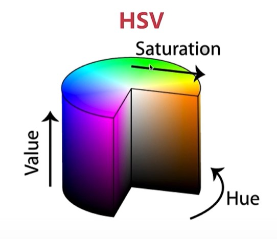
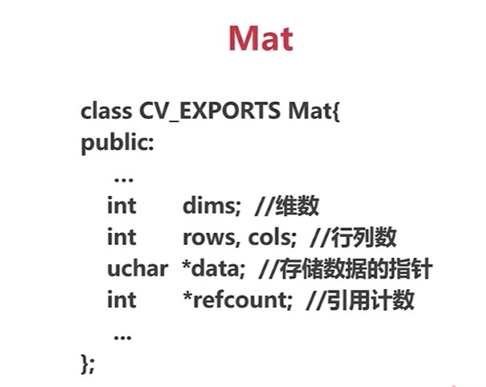

# 色彩空间
RGB: 人眼的色彩空间

OpenCV默认使用BGR ([HSV](https://blog.csdn.net/u013066730/article/details/103893273), [HSL](https://baike.baidu.com/item/HSL/1443144?fr=aladdin), [YUV](https://blog.csdn.net/mzpmzk/article/details/81239532))

## HSV
- Hue : 色相，即色彩，如红色、蓝色
- Saturation : 饱和度，颜色的纯度
- VAlue : 明度




```python
import cv2


def callback():
    pass


if __name__ == '__main__':
    cv2.namedWindow('color', cv2.WINDOW_NORMAL)

    img = cv2.imread('../../../image/test.png')

    colorspace = [cv2.COLOR_BGR2BGRA,
                  cv2.COLOR_BGR2RGBA,
                  cv2.COLOR_BGR2GRAY,
                  cv2.COLOR_BGR2HSV_FULL,
                  cv2.COLOR_BGR2YUV,
                  cv2.COLOR_BGR2HSV
                  ]
    cv2.createTrackbar('colorBar', 'color', 0, len(colorspace), callback)

    while True:
        bar = cv2.getTrackbarPos('colorBar', 'color')
        # 颜色空间转换
        cvt_img = cv2.cvtColor(img, colorspace[bar])
        cv2.imshow('color', cvt_img)

        key = cv2.waitKey(10)
        if key & 0xFF == ord('q'):
            break

    cv2.destroyAllWindows()
```
# Numpy 
详见: <https://www.runoob.com/numpy/numpy-tutorial.html>

# Mat


## Mat 浅拷贝
```cpp
Mat A = imread(file, IMREAD_COLOR);
Mat B(A);
```

## Mat 深拷贝
```cpp
cv::Mat::clone();
cv::Mat::copyTo();
```
## 通道的分离与合并
api
```python
split(mat)
merge((ch1, ch2, ...))
```
example
```python
import cv2

if __name__ == '__main__':
    img = cv2.imread(r'../../../image/test.png', cv2.IMREAD_COLOR)

    b, g, r = cv2.split(img)
    b[10:100, 10:100] = 255
    g[10:100, 10:100] = 255

    img2 = cv2.merge((b, g, r))

    cv2.imshow('img', img)
    cv2.imshow('b', b)
    cv2.imshow('g', g)
    cv2.imshow('r', r)
    cv2.imshow('img2', img2)
    cv2.waitKey(0)
```